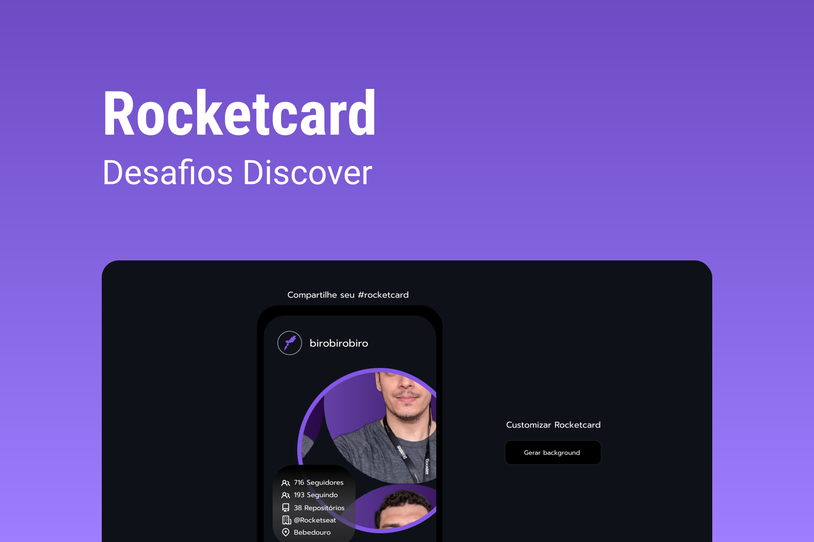

<h1 align="center"> Cartão de Apresentação Github </h1>

Consumindo API Github para criar um cartão de visitas

  <a href="#-tecnologias">Tecnologias</a>&nbsp;&nbsp;&nbsp;|&nbsp;&nbsp;&nbsp;
  <a href="#-projeto">Projeto</a>&nbsp;&nbsp;&nbsp;|&nbsp;&nbsp;&nbsp;
  <a href="#-layout">Layout</a>&nbsp;&nbsp;&nbsp;|&nbsp;&nbsp;&nbsp;
  <a href="#memo-licença">Licença</a>

  

 

  

## 🚀 Tecnologias

Esse projeto foi desenvolvido com as seguintes tecnologias:

- HTML e CSS
- API e fetch
- Git e Github
- ReactJS

## 💻 Projeto

Primeiro projeto utilizando o ReactJS;
Consumindo API Github para criar um cartão de apresentação;

## 🔖 Layout

Você pode visualizar o layout do projeto através [DESSE LINK](https://www.figma.com/file/6PkWPTSchUg9ca2iIzjG3V/DD-%2F-Rocketcard-(Copy)?node-id=3%3A2&t=0b2ROodnbpkDOVqu-0). É necessário ter conta no [Figma](https://figma.com) para acessá-lo.

## :memo: Licença

Esse projeto está sob a licença MIT.

---

Desafio Rocketseat :wave: [Participe da comunidade!](https://discord.gg/rocketseat)
 
Feito por: Felipe Coelho (felipeaacoelho@gmail.com)
